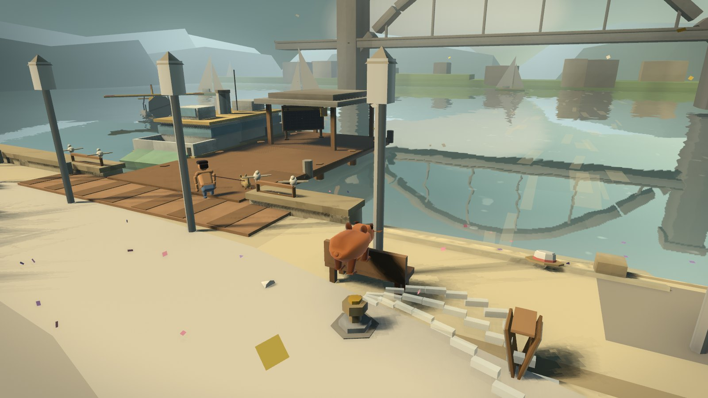
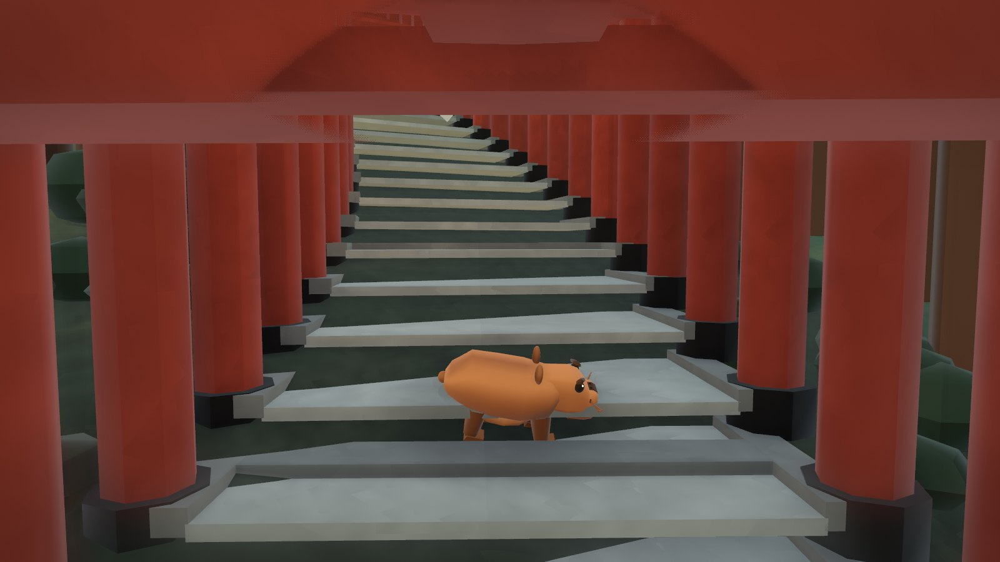
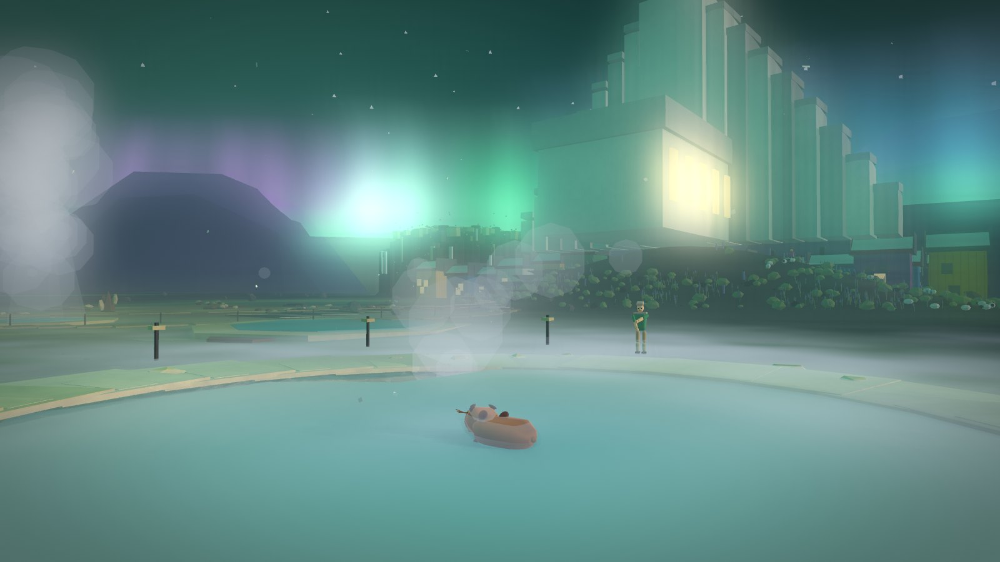
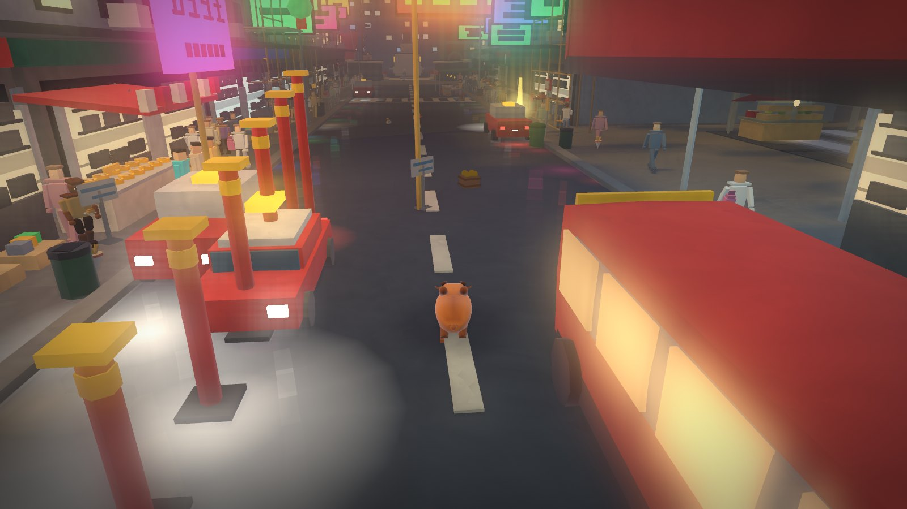
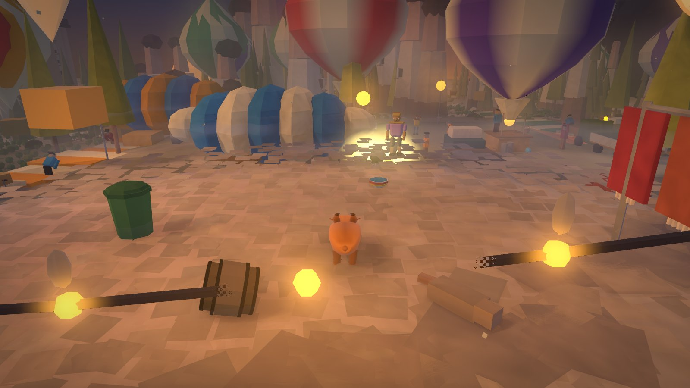
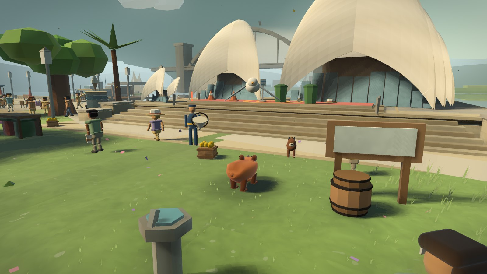
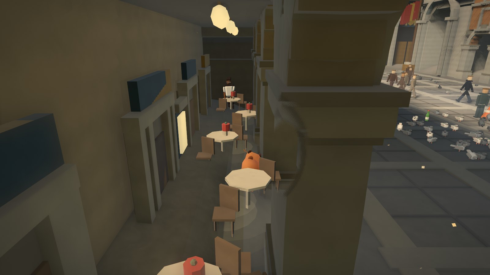
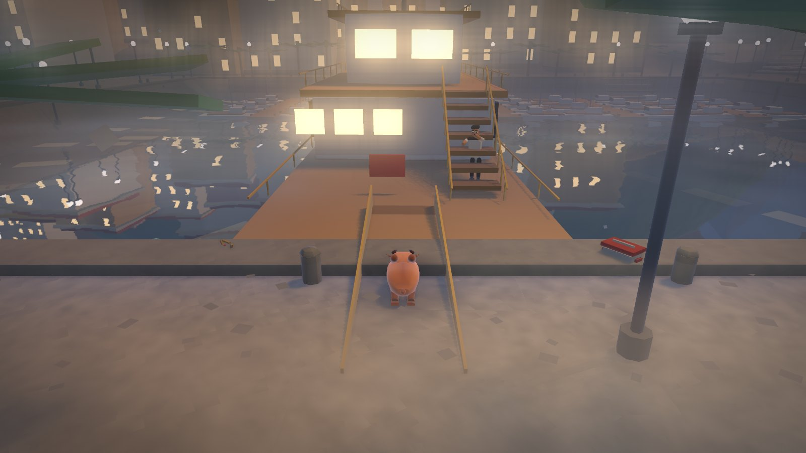

# Capybara Abroad

**Play in your browser: https://urbantorque.github.io/capybara-abroad/**.
It's one file: no install, no account, and it saves in your browser.

A cosy, mischievous travel game. A capybara follows a traveller's bag
through nineteen real places and brings one memory home from each, for the
shelf in Sydney's Botanic Gardens. On the way it knocks things over, steals
hats and gets chased, and an ibis from the Gardens keeps trying to steal its
yuzu.

| | |
|---|---|
|  |  |
|  |  |
|  |  |
|  |  |

The places: Sydney, Pasto, Circular Quay, Kyoto and Uji, Cali, Rio,
Iceland, Marrakech, the Drift, Venice, Hong Kong, Palawan, Cappadocia,
Manly, the Pantanal, Sơn Đoòng, Antarctica, Monte Carlo and Hanoi.

## Two ways to play

- **Story** is the bag going home: five folds of a map, two memories in
  each, a keepsake for every one, an ibis with its own ideas, and an ending
  on the lawn.
- **Free roam** is HAVOC: all nineteen places on one wall, no list, a streak
  for every piece of mischief, sixty-second runs from a gold ring with a
  medal to beat, and pests (a gull, a warden, a dog) to see off with a
  flicked yuzu pip. Three hearts; get caught and it drops five yuzu.

## Playing

| | |
|---|---|
| Move · run · hop | W A S D · Shift · Space |
| Take / drop · wheek | E · Q |
| Flick a yuzu pip (Free roam) | V |
| Another go after a run | Enter |
| The list of things to do · next thing | L · F |
| Journal or departures · look around · mute | Tab · drag or C · M |
| The map | hover over or hold the corner map |
| Photo · hide the HUD · pause | K · P · Esc |

In Monte Carlo the red car drives like a car: W and S, A and D, and E to get
in and out.

## Running it

```
npm start          # serves src/ unbundled on http://localhost:5188
node build.mjs     # one self-contained dist/untitled-capybara-game.html
npm test           # 81 static checks, ~3 minutes, no browser
```

There are no dependencies. Three.js and cannon-es are vendored in `vendor/`
and inlined by the build. Browser checks live in `qa/`, run against the dev
server in headful Edge (see `qa/reimagine-harness.mjs`).

## The repository

| | |
|---|---|
| `src/` | 30 modules: `shared.js` (palette, chapters, tasks, shaders), `systems.js` (HUD, save, score, camera), `npc.js` (people and animals), `capybara.js`, `props.js`, `rival.js`, `havoc.js` (Free Roam's HAVOC), and one file per place |
| `qa/` | Instruments and checks. Results (`qa/**/*.png`) are git-ignored |
| `docs/CONTRACT.md` | What shipped, newest first, with the measured numbers |
| `docs/roadmaps/` | One roadmap per pass. `ROADMAP-AAA.md` is the latest |
| `docs/handoff/` | State of play and working notes for whoever picks this up next |
| `docs/archive/` | Retired reviews and the old long README |
| `AGENTS.md` | The rules for working on the code: read it first |

## Licence

None yet: see `LICENSING.md`. Playing is fine; redistributing isn't, until
the author picks a licence.
